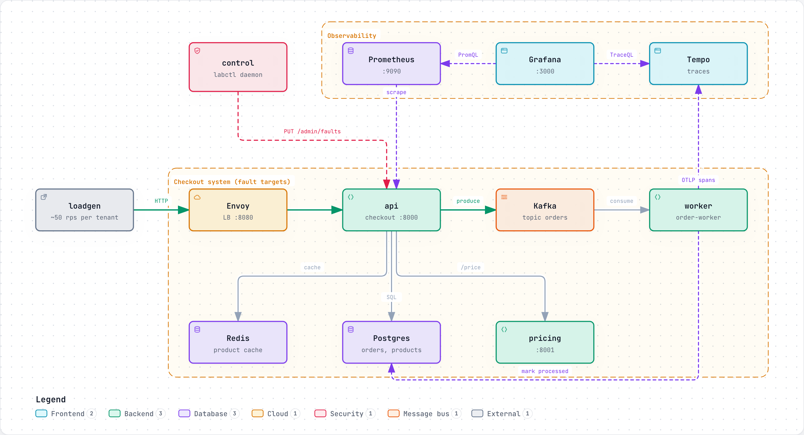
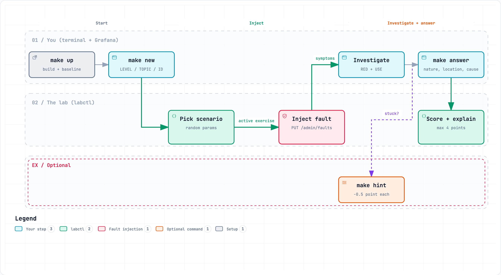

# redlab: a hands-on lab for RED and USE

A small checkout system that runs with Docker Compose (Envoy, api, pricing, Postgres, Redis, Kafka, worker)
plus Prometheus, Grafana and Tempo. The lab injects a random incident. You investigate it with RED and USE,
submit an answer, and the lab scores it.

The full guide lives in the lab doc that goes with this repo.

> **For training only.** This repo exists to teach the RED and USE methods. The services break on
> purpose, and the code is not meant for production use.

## How it works

### The system



- **Request path.** `loadgen` sends about 50 rps of checkout traffic through Envoy to `api`. `api` reads
  products from Redis and Postgres, calls `pricing`, then writes each order to Kafka. `worker` consumes
  the `orders` topic and marks each order done in Postgres.
- **Fault loop.** `control` runs `labctl daemon`. Every 3 seconds it reads the active exercise from
  `state.json`, sends the fault settings to each service on `PUT /admin/faults`, and sets the api CPU
  limit. A manual change is reverted on the next tick.
- **What you look at.** Prometheus scrapes `/metrics` on every service. Every service sends spans to
  Tempo. Grafana has the RED and USE dashboards by layer, and the traces too. Each dot on a latency
  panel is an exemplar: click it to open one real request that landed in that bucket.

### One exercise



1. `make up` builds and starts everything. Wait 3 to 5 minutes so the dashboards show a normal baseline.
2. `make new` picks a scenario you did not play in the last 5 rounds. It draws random parameters and
   saves them as the active exercise. Within 3 seconds the daemon turns the fault on.
3. You read the ticket and investigate with RED and USE in Grafana. Traces are there too (Explore > Tempo).
4. `make answer` asks three multiple choice questions: the nature of the problem, the location and the
   cause. You get nature 1, location 1, cause 2 (1 for a partial cause), so 4 points max. Each
   `make hint` you used takes 0.5 off.
5. You see the explanation and the PromQL that proves it. Press Enter to clear the fault, then
   `make new` again.

Hints, answers, scoring and the `make quiz` drills are all built into `labctl`. They run offline and
need no account or API key.

For an interactive view (zoom, search, trace a path), open `docs/diagrams/architecture.html` or
`docs/diagrams/exercise-flow.html` in a browser. The `.json` files next to them are the diagram sources.

## Quick start

You need Docker Desktop (give it 4 CPUs and 8 GB RAM) or OrbStack (no settings needed), and `make`.
Nothing else is installed on your machine: the services are built inside Docker.

```bash
make up        # build + start, wait until ready (the first build takes several minutes)
# open http://localhost:3000 (Grafana: dashboards and traces)
make new       # get an exercise
make hint      # a hint (costs 0.5 point)
make answer    # submit, see the explanation
make quiz      # numeric drills
make down      # stop and remove everything
```

`make` with no target lists every command.

## Layout

- `service/`: the Kotlin services, one Gradle build. `tool/labctl` is the controller and the CLI;
  `tool/labctl/.../scenario/ScenarioCatalog.kt` holds the answers, do not read it before you play.
- `config/`: Envoy, Prometheus, Grafana (pre-built dashboards), Postgres.
- `service/tool/dashboards`: regenerates the Grafana dashboards (`make dashboards`).

## Development

The services are Kotlin on Micronaut, built with Gradle. `make up` builds them inside Docker, so a JDK is
optional. With a JDK on the machine (Gradle downloads JDK 21 itself):

```bash
make build     # ./gradlew installDist
make test      # unit tests
make lint      # ktlint
```

To rebuild one service after a change: `docker compose up -d --build api`. Every service shares the
`redlab-svc` image, so this rebuilds the image once; restart the other services to pick it up.

## Datadog (optional, experimental)

Put `DD_API_KEY` in `.env`, then `make up-datadog`. Traces go to the Datadog Agent instead of Tempo.

## License

MIT. See [LICENSE](LICENSE).
